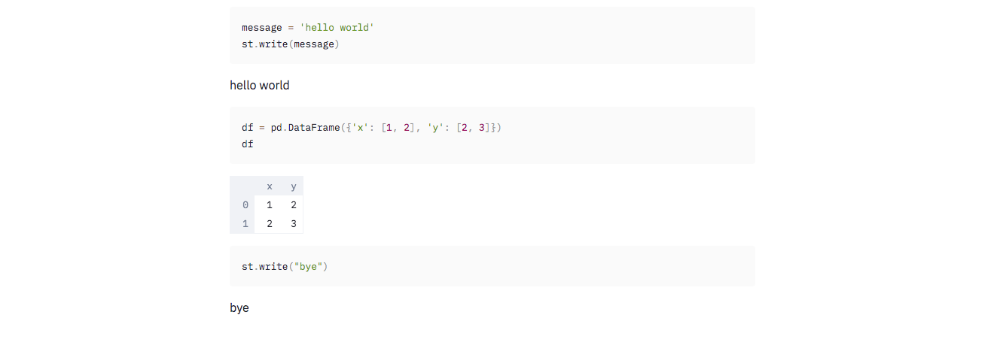

Yesterday I learned about [Streamlit](https://streamlit.io/docs/), which is really neat. Check it out.

To use streamlit like a Jupyter notebook, I want all (or most) of my code to be echoed to the output in blocks. [streamlit.echo](https://streamlit.io/docs/api.html?highlight=echo#streamlit.echo) can do this, but putting all of my code in `echo()` blocks would be a bit messy/verbose.

So I implemented `end_code_block`, which is similar. Here's how to use it:

```
from end_code_block import end_code_block as _____
import streamlit as st
import pandas as pd
_____(display=False)

message = 'hello world'
st.write(message)
_____()

df = pd.DataFrame({'x': [1, 2], 'y': [2, 3]})
df
_____()

st.write("bye")
_____()
```

I've imported `end_code_block` with the weird name `_____` because I think it creates a nice-looking separation between blocks and avoids clutter.

The output looks like this:


